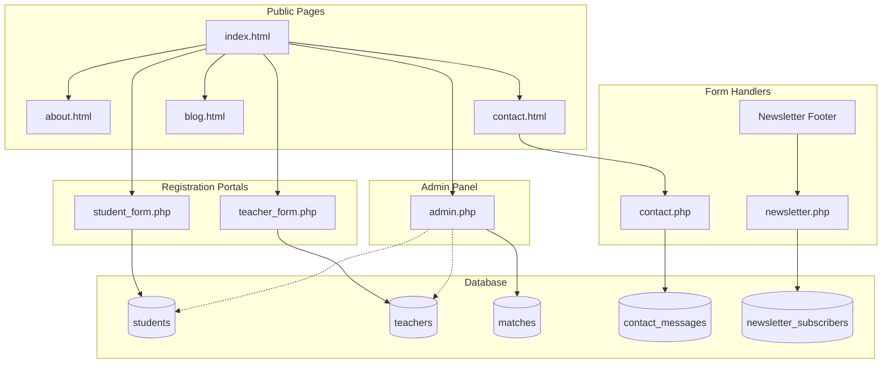
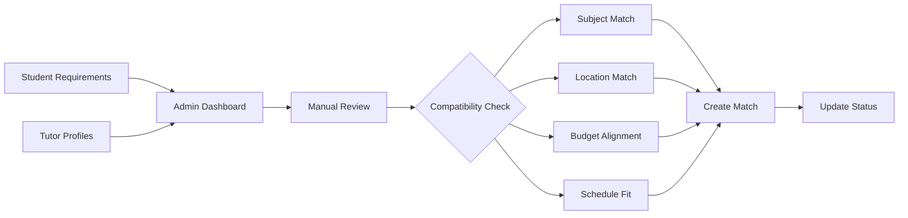

# 🎓 Abbott Home Tuitions
### *A Community Platform Connecting Students with Qualified Home Tutors*

[]()
[]()
[]()
[]()

---

## 📑 Table of Contents
- [Overview](#-overview)
- [Problem Statement](#-problem-statement--motivation)
- [Core Features](#-core-features)
- [Technology Stack](#️-technology-stack)
- [System Architecture](#-system-architecture)
- [Database Schema](#-database-schema)
- [Current Matching System](#-current-matching-system)
- [Future Vision](#-future-enhancements--vision)
- [Installation & Setup](#️-installation--setup)
- [Project Impact](#-project-impact--community-value)
- [Technical Competencies](#-technical-competencies-demonstrated)
- [Developer](#-developer)

---

## 📖 Overview

**Abbott Home Tuitions** is a responsive web platform designed to connect students and parents with qualified home tutors in the local community. The platform addresses the challenge of finding reliable, quality tutors by providing a centralized hub where families can discover educators and tutors can find teaching opportunities.

The platform features **separate portals** for students/parents and tutors, allowing both parties to create detailed profiles and specify their requirements or offerings. An **admin dashboard** facilitates the matching process, where administrators review profiles and create appropriate tutor-student pairings based on subject expertise, location, availability, and budget considerations.

This is a **community-focused initiative** aimed at democratizing access to quality education. Our vision includes implementing AI-driven automated matching in the future, transforming the platform into a fully intelligent tutoring marketplace.

---

## 💡 Problem Statement & Motivation

### The Challenge
Finding quality home tutors has traditionally been:
- **Inefficient**: Parents rely on word-of-mouth, often finding unsuitable matches
- **Non-transparent**: No visibility into qualifications, rates, or availability
- **Time-consuming**: Weeks of searching through informal networks
- **Risky**: Trust and quality concerns without verified profiles

### Our Solution
Abbott Home Tuitions creates a **structured, transparent marketplace** that:
- Centralizes verified tutor and student profiles
- Provides clear information for informed decisions
- Enables efficient admin-facilitated matching
- Builds community trust through organized management

---

## ✨ Core Features

| Feature                          | Description                                                                |
|----------------------------------|----------------------------------------------------------------------------|
| **Dual Portal System**           | Separate registration and dashboards for students/parents and tutors       |
| **Comprehensive Profiles**       | Detailed forms capturing requirements, expertise, budget, and availability |
| **Admin Dashboard**              | Centralized management with statistics, filters, and matching tools        |
| **Manual Matching System**       | Admins create tutor-student pairs based on compatibility factors           |
| **Contact Queries Management**   | Inbox for contact form submissions                                         |
| **Newsletter System**            | Email subscription for updates and announcements                           |
| **Responsive Design**            | Seamless experience across mobile, tablet, and desktop                     |
| **Secure Authentication**        | Password hashing for admin login                                           |
| **Status Tracking**              | Track pending, matched, and active users                                   |

---

## 🛠️ Technology Stack

### Frontend
| Technology             | Version | Purpose                              |
|------------------------|---------|--------------------------------------|
| HTML5                  | -       | Semantic structure and markup        |
| CSS3 / SCSS            | -       | Styling with Bootstrap theming       |
| Bootstrap              | 4.4.1   | Responsive grid and UI components    |
| JavaScript (jQuery)    | 3.4.1   | DOM manipulation and AJAX            |

### UI Libraries
| Library                | Purpose                                        |
|------------------------|------------------------------------------------|
| Owl Carousel           | Responsive testimonial sliders                 |
| Font Awesome           | Scalable vector icons                          |
| Google Fonts (Poppins) | Modern typography                              |

### Backend
| Technology             | Purpose                                        |
|------------------------|------------------------------------------------|
| PHP                    | Form processing, sessions, database operations |
| MySQL                  | User profiles, matches, messages storage       |

### Security Measures
- Password hashing using `password_hash()` and `password_verify()`
- Input sanitization and escaping
- Session-based authentication
- Form validation (client & server-side)

---

## 🏗️ System Architecture

### High-Level Overview
```
┌──────────────────────────────────────────────────────────┐
│                    USER INTERFACE                        │
│   ┌──────────┐  ┌──────────┐  ┌──────────┐  ┌────────┐   │
│   │  Public  │  │ Student  │  │  Tutor   │  │ Admin  │   │
│   │  Pages   │  │  Portal  │  │  Portal  │  │ Panel  │   │
│   └──────────┘  └──────────┘  └──────────┘  └────────┘   │
└──────────────────────────────────────────────────────────┘
                            ↕
┌──────────────────────────────────────────────────────────┐
│              PRESENTATION LAYER                          │
│          HTML5 | CSS3/SCSS | Bootstrap | jQuery          │
└──────────────────────────────────────────────────────────┘
                            ↕
┌──────────────────────────────────────────────────────────┐
│              APPLICATION LAYER (PHP)                     │
│     Form Handlers | Authentication | Matching Logic      │
└──────────────────────────────────────────────────────────┘
                            ↕
┌──────────────────────────────────────────────────────────┐
│                 DATA LAYER (MySQL)                       │    
│    Students | Teachers | Matches | Admin | Messages      │
└──────────────────────────────────────────────────────────┘
```

### Site Structure
```
Abbott Home Tuitions
├── Public Pages
│   ├── Home (index.html)
│   ├── About Us (about.html)
│   ├── Contact (contact.html)
│   └── Blog (blog.html)
├── Student/Parent Portal
│   └── Registration Form (student_form.php)
├── Tutor Portal
│   └── Registration Form (teacher_form.php)
└── Admin Panel (admin.php)
    ├── Students Tab
    ├── Teachers Tab
    ├── Matches Tab
    ├── Queries Tab
    └── Subscribers Tab
```

### Navigation Flow




---

## 📊 Database Schema

### students
| Column           | Type    | Description                |
|------------------|---------|----------------------------|
| id               | INT     | Unique identifier          |
| full_name        | VARCHAR | Parent/guardian name       |
| email            | VARCHAR | Contact email              |
| phone            | VARCHAR | Contact number             |
| address          | VARCHAR | Location                   |
| student_name     | VARCHAR | Student's name             |
| student_grade    | VARCHAR | Current grade level        |
| subjects         | TEXT    | Required subjects          |
| frequency        | VARCHAR | Sessions per week          |
| duration         | VARCHAR | Session duration           |
| preferred_timing | VARCHAR | Available time slots       |
| budget_min/max   | DECIMAL | Budget range               |
| status           | ENUM    | pending/matched/active     |

### teachers
| Column           | Type    | Description                |
|------------------|---------|----------------------------|
| id               | INT     | Unique identifier          |
| full_name        | VARCHAR | Tutor name                 |
| email            | VARCHAR | Contact email              |
| phone            | VARCHAR | Contact number             |
| qualification    | TEXT    | Education credentials      |
| experience       | INT     | Years of experience        |
| subjects         | TEXT    | Subjects taught            |
| preferred_grades | TEXT    | Grade levels               |
| rate_per_hour    | DECIMAL | Hourly rate                |
| availability     | TEXT    | Available time slots       |
| status           | ENUM    | pending/active/matched     |

### matches
| Column           | Type      | Description              |
|------------------|-----------|--------------------------|
| id               | INT       | Match identifier         |
| student_id       | INT       | References students      |
| teacher_id       | INT       | References teachers      |
| match_date       | TIMESTAMP | When match was created   |
| status           | ENUM      | pending/active/completed |

### admin_users
| Column           | Type      | Description              |
|------------------|-----------|--------------------------|
| id               | INT       | Admin identifier         |
| username         | VARCHAR   | Login username           |
| password_hash    | VARCHAR   | Hashed password          |
| full_name        | VARCHAR   | Administrator name       |

---

## 🔗 Current Matching System

### How It Works (Admin-Facilitated)



**Step-by-Step Process:**
1. **Data Collection** - Students and tutors submit detailed profiles
2. **Admin Review** - Dashboard shows all pending registrations with filters
3. **Compatibility Analysis** - Check subject, location, budget, schedule
4. **Match Creation** - Admin pairs compatible student-tutor combinations
5. **Status Update** - Both parties marked as "matched"

---

## 🚀 Future Enhancements & Vision

### AI-Powered Matching (Planned)

| Phase                 | Description                                  |
|-----------------------|----------------------------------------------|
| **Phase 1** (Current) | Collect matching data, analyze patterns      |
| **Phase 2**           | Develop weighted scoring algorithm           |
| **Phase 3**           | Deploy automated matching suggestions        |
| **Phase 4**           | Full AI-driven matching with ML optimization |

### Upcoming Features
- Real-time messaging system
- Rating and review functionality
- Payment gateway integration
- Mobile application (iOS/Android)
- Video conferencing for online sessions

---

## ⚙️ Installation & Setup

### Prerequisites
- Apache/Nginx web server (XAMPP recommended)
- PHP 7.4+
- MySQL 5.7+

### Quick Setup
```bash
# 1. Clone repository
git clone https://github.com/username/abbott-home-tuitions.git

# 2. Place in web server directory
# For XAMPP: C:\xampp\htdocs\abbott-home-tuitions

# 3. Create database
mysql -u root -p
CREATE DATABASE abbott_tuitions;

# 4. Run setup SQL (tables are auto-created on first use)

# 5. Access the application
http://localhost/abbott-home-tuitions

# 6. Create admin account
http://localhost/abbott-home-tuitions/setup_admin.php
```

---

## 🌟 Project Impact & Community Value

### For Students & Families
✅ Access to verified, qualified tutors  
✅ Transparent pricing and qualifications  
✅ Time-saving centralized platform  
✅ Safe, admin-verified profiles

### For Tutors
✅ Professional platform to showcase skills  
✅ Find students matching their expertise  
✅ Flexible work opportunities  
✅ Reduced marketing effort

### For the Community
✅ Strengthens local education infrastructure  
✅ Creates employment for educators  
✅ Democratizes access to quality tutoring  

---

## 💡 Technical Competencies Demonstrated

| Area             | Skills                                                            |
|------------------|-------------------------------------------------------------------|
| **Frontend**     | HTML5, CSS3, SCSS, Bootstrap 4, jQuery, Responsive Design         |
| **Backend**      | PHP form processing, Session management, Database operations      |
| **Database**     | MySQL schema design, CRUD operations, JOIN queries                |
| **Security**     | Password hashing, Input sanitization, SQL injection prevention    |
| **Design**       | Mobile-first approach, UI/UX principles, Information architecture |
| **Integration**  | Owl Carousel, Font Awesome, Google Fonts                          |

---

## 👨‍💻 Developer

**Amir Ali Shah**

| Category      | Details                                                        |
|---------------|----------------------------------------------------------------|
| **Role**      | Full-Stack Development, Database Design, UI/UX                 |
| **Frontend**  | HTML5, CSS3, SCSS, Bootstrap 4, JavaScript, jQuery             |
| **Backend**   | PHP, MySQL                                                     |
| **Tools**     | Git, VS Code, XAMPP, Browser DevTools                          |

---

## 🙏 Acknowledgments

- **Bootstrap Team** - Responsive framework
- **jQuery Team** - DOM manipulation library
- **Owl Carousel** - Smooth sliders
- **Font Awesome** - Icon library
- **Google Fonts** - Poppins typography

---

## 📞 Contact

**Abbott Home Tuitions**  
📍 Kaghan Colony Mandia, Abbottabad  
📧 abbotthometuitions@gmail.com  
📱 +92 319 0964392

---

*This is a community-focused educational project aimed at improving access to quality tutoring services.*
